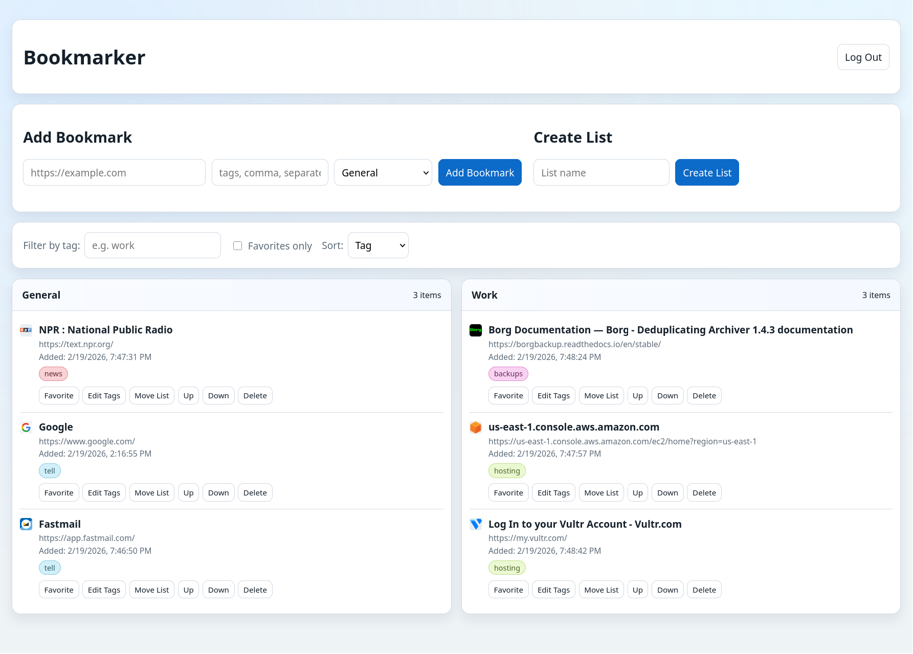

## Run

1. Create env file:
   ```bash
   cp .env.example .env
   ```
2. Edit `.env` and set a strong `SESSION_SECRET`.
3. Build and run:
   ```bash
   docker compose up --build
   ```
4. Open `http://localhost:3000`.
5. On first launch, create a master password in the setup screen.

## Security Model

- The app no longer stores an app password in `.env`.
- The master password is stored as a salted `scrypt` hash in SQLite.
- List names and bookmark fields (`url`, `title`, `favicon`, `tags`, `created_at`) are encrypted at rest with `AES-256-GCM`.
- The encryption key is derived from the password at login and kept only in server memory/session.
- Existing plaintext list/bookmark rows are automatically encrypted after first successful setup/login.

## Practical Hardening

- Keep `.env` readable only by your user (example: `chmod 600 .env`).
- Keep the `data/` volume private to the host user.
- Use full-disk encryption on the host.
- If exposing beyond localhost, put the app behind HTTPS.

This app is intended for single-user/self-hosted usage.
